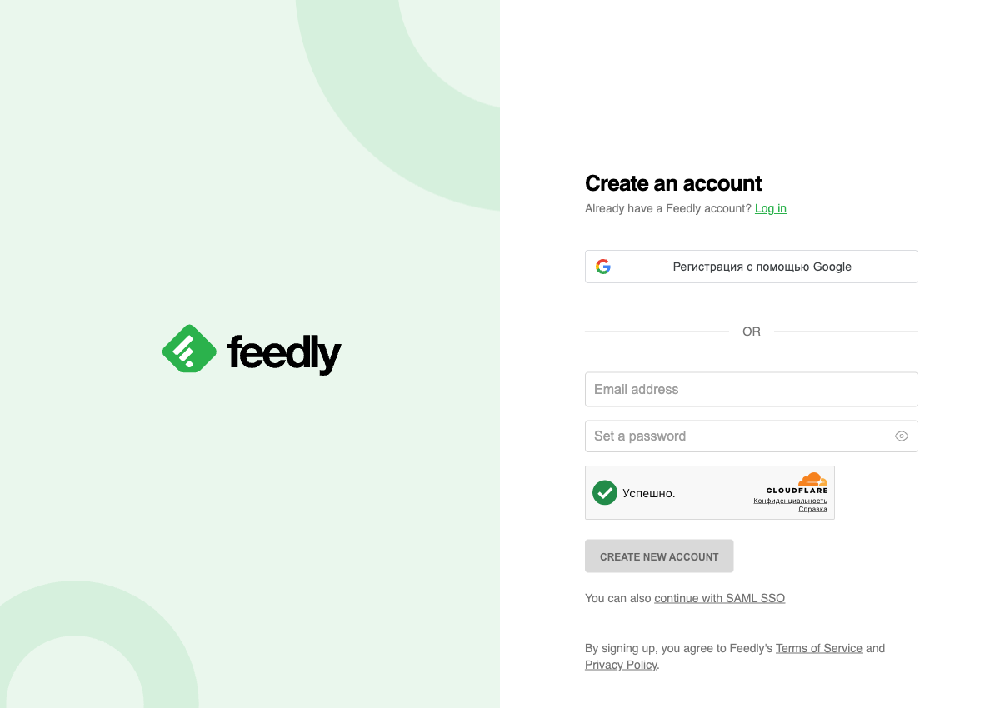
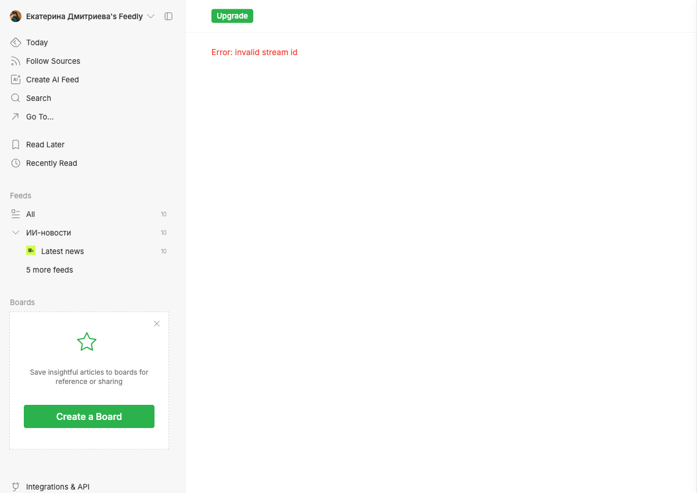
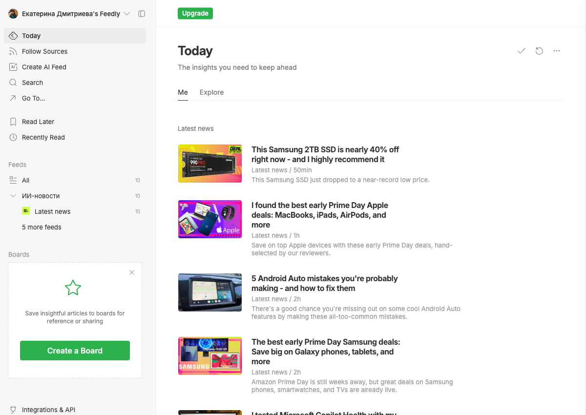

# AI News Monitor

Автоматический дайджест ИИ-новостей для контент-менеджеров Telegram-каналов.

**Проблема:** 1–2 часа в день на ручной просмотр 7+ источников по теме ИИ и no-code.  
**Решение:** скрипт парсит RSS-ленты, фильтрует по ключевым словам, затем Claude оценивает каждую статью по релевантности 1–5 — утренний дайджест готов за 30 секунд.

---

## Демо

### Запуск скрипта

```
╭──────────────────────────────────╮
│ AI News Monitor                  │
│ Сбор новостей за последние 24 ч. │
╰──────────────────────────────────╯

1. Загружаю RSS-ленты...
  Загружаю Zerocoder... 0 статей
  Загружаю ZDNet... 18 статей
  Загружаю Forbes AI... 0 статей
  Загружаю TechCrunch AI... 10 статей

Всего найдено: 28 статей

2. Фильтрую по ключевым словам...
Релевантных: 10

3. Анализирую с помощью Claude...

📰 Дайджест ИИ-новостей — 05.06.2026

Оценка релевантности (Claude):
[1] ⭐ 5/5 | О чём: Apple approves first AI agent on its Messenger platform
[2] ⭐ 4/5 | О чём: Anthropic's Daniela Amodei on IPO plans and company vision
[3] ⭐ 4/5 | О чём: Meta rolls out new AI creator assistant on Facebook
[4] ⭐ 3/5 | О чём: Google Drive's new AI cleanup tool tested in real conditions
[5] ⭐ 2/5 | О чём: Microsoft continues its big Linux push at Build 2026
```

### Настройка в Feedly

| Шаг | Экран |
|-----|-------|
| Регистрация |  |
| Добавление источников |  |
| Подключение Telegram-каналов через rss.app |  |
| Итоговая лента |  |

---

## Структура проекта

```
final_project/
├── monitor.py              # главный скрипт
├── requirements.txt        # зависимости
├── .env.example            # шаблон для API-ключа
├── .claude/
│   └── commands/
│       └── digest.md       # Claude Code skill /digest
└── README.md
```

---

## Быстрый старт

```bash
# 1. Клонировать репозиторий
git clone https://github.com/gavrish921/ai-news-monitor.git
cd ai-news-monitor

# 2. Установить зависимости
pip3 install -r requirements.txt

# 3. Добавить API-ключ
cp .env.example .env
# вставить свой ANTHROPIC_API_KEY в .env

# 4. Запустить
python3 monitor.py          # дайджест за 24 часа
python3 monitor.py 72       # за 72 часа
```

---

## Использование скилла в Claude Code

После клонирования репозитория в Claude Code появится команда `/digest`:

```
/digest        → дайджест за последние 24 часа
/digest 48     → за последние 48 часов
```

Скилл запускает `monitor.py`, выводит оценённые статьи и предлагает выбрать топ-пики для контент-плана.

---

## Источники (RSS)

| Название | Тип | URL |
|----------|-----|-----|
| Zerocoder | Веб | https://ya.zerocoder.ru/feed/ |
| ZDNet | Веб | https://www.zdnet.com/news/rss.xml |
| Forbes AI | Веб | https://www.forbes.com/ai/feed2.xml |
| TechCrunch AI | Веб | https://techcrunch.com/category/artificial-intelligence/feed/ |
| @neuraldvig | Telegram → RSS | через rss.app |
| @PushEnter | Telegram → RSS | через rss.app |
| @aioftheday | Telegram → RSS | через rss.app |
| @ai_volution | Telegram → RSS | через rss.app |

---

## Ключевые слова для фильтрации

`ИИ`, `нейросеть`, `no-code`, `автоматизация`, `ChatGPT`, `Claude`, `Midjourney`, `Gemini`, `GPT`, `LLM`, `AI`, `machine learning`, `automation`, `агент`, `agent`, `workflow`

---

## Метрики

| Показатель | До | После |
|---|---|---|
| Время на мониторинг | 60–120 мин/день | ~20 мин/день |
| Количество источников | 7 (вручную) | 8 (автоматически) |
| Пропущенные инфоповоды | не отслеживается | 0 значимых |

---

## Автор

Катя — Community Manager, [Zerocoder](https://zerocoder.ru)  
Финальный проект курса по автоматизации с Claude Code.
